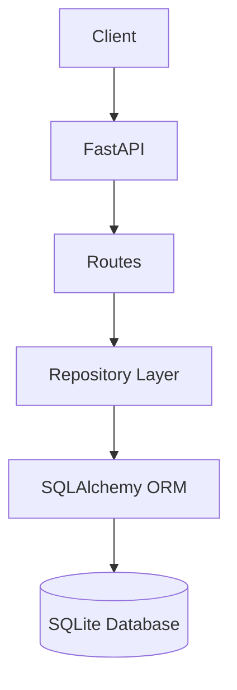

# 🚀 Task API — SQLite Integration

### Week 3 • A2 Connecting to the database
### Backend AI Engineering Internship — FlyRank AI

A RESTful Task Management API built with **FastAPI**, **SQLAlchemy**, and **SQLite**.

This project upgrades the original CRUD API by replacing the in-memory task storage with a persistent SQLite database while keeping the API endpoints unchanged. It demonstrates the separation between the API layer and the data layer, one of the core concepts of backend engineering.

---

# ✨ Highlights

- ⚡ FastAPI REST API
- 🗄 SQLite Database
- 🧩 SQLAlchemy ORM
- 🏗 Repository Pattern
- 📚 Interactive Swagger UI
- 🔍 Automatic Database Creation
- 📦 Automatic Table Creation
- 🌱 Automatic Initial Data Seeding
- 💾 Persistent Data Storage
- ✅ Full CRUD Operations

---

# 🏗 Architecture



---

# 🛠 Tech Stack

| Category | Technology |
|----------|------------|
| Language | Python 3.10+ |
| Framework | FastAPI |
| Database | SQLite |
| ORM | SQLAlchemy |
| Validation | Pydantic |
| API Docs | Swagger UI |
| Server | Uvicorn |

---

# 📁 Project Structure

```text
task-api-sqlite/
│
├── app/
│   ├── __init__.py
│   ├── database.py
│   ├── main.py
│   ├── models.py
│   ├── repository.py
│   ├── routes.py
│   ├── schemas.py
│   └── services.py
│
├── requirements.txt
├── README.md
└── tasks.db (auto-generated)
```

---

# 🎯 Assignment Objectives

This project fulfills all Week 3 Assignment 1 requirements.

| Requirement | Status |
|-------------|:------:|
| SQLite database integration | ✅ |
| SQLAlchemy ORM | ✅ |
| Automatic database creation | ✅ |
| Automatic table creation | ✅ |
| Automatic sample data insertion | ✅ |
| Persistent storage | ✅ |
| CRUD API | ✅ |
| Swagger Documentation | ✅ |
| Proper HTTP Status Codes | ✅ |
| Repository Pattern | ✅ |

---

# ⚙ Getting Started

## 1. Clone the Repository

```bash
git clone https://github.com/Devanshu07R/flyrank-task-api.git
```

---

## 2. Navigate to the SQLite Project

```bash
cd task-api-sqlite
```

---

## 3. Create Virtual Environment

### Windows

```bash
python -m venv venv

venv\Scripts\activate
```

### Linux / macOS

```bash
python3 -m venv venv

source venv/bin/activate
```

---

## 4. Install Dependencies

```bash
pip install -r requirements.txt
```

---

## 5. Run the API

```bash
uvicorn app.main:app --reload
```

Application

```
http://127.0.0.1:8000
```

Swagger

```
http://127.0.0.1:8000/docs
```

ReDoc

```
http://127.0.0.1:8000/redoc
```

---

# 📡 API Endpoints

| Method | Endpoint | Description |
|---------|----------|-------------|
| GET | / | API Information |
| GET | /tasks | Retrieve all tasks |
| GET | /tasks/{id} | Retrieve a specific task |
| POST | /tasks | Create a new task |
| PUT | /tasks/{id} | Update an existing task |
| DELETE | /tasks/{id} | Delete a task |

---

# 💾 SQLite Database

Database file

```
tasks.db
```

The database is automatically created during the first application startup.

The **tasks** table is automatically generated using SQLAlchemy.

If the table is empty, three sample tasks are inserted automatically.

Sample data:

- Learn FastAPI
- Build CRUD API
- Practice SQLite

---

# 🔍 SQL Queries Executed

### Retrieve all tasks

```sql
SELECT * FROM tasks;
```

### Retrieve completed tasks

```sql
SELECT * FROM tasks WHERE done = 1;
```

### Count total tasks

```sql
SELECT COUNT(*) FROM tasks;
```

### Mark all tasks as completed

```sql
UPDATE tasks
SET done = 1;
```

### Delete completed tasks

```sql
DELETE FROM tasks
WHERE done = 1;
```

---

# 📸 Screenshots

## Swagger UI

```
images/swagger-ui.png
```

---

## SQLite Database

```
images/sqlite-db.png
```

---

## CRUD Operations

```
images/crud-demo.png
```

---

# 💡 What I Learned

During this assignment I learned:

- Building persistent REST APIs
- Integrating SQLite with FastAPI
- Using SQLAlchemy ORM
- Creating databases automatically
- Creating tables automatically
- Implementing Repository Pattern
- Managing database sessions
- Persisting application data
- Executing SQL queries
- Maintaining API consistency while changing the storage layer

---

# 🚀 Future Improvements

- PostgreSQL Integration
- Docker Support
- Alembic Migrations
- JWT Authentication
- User Management
- Search & Filtering
- Pagination
- Automated Testing

---

# 👨‍💻 Author

**Devanshu Dasgupta**

Backend AI Engineering Intern — FlyRank AI

- GitHub: https://github.com/Devanshu07R
- LinkedIn: https://linkedin.com/in/devanshudasgupta

---

# ⭐ Support

If you found this project useful, consider giving the repository a **Star**.

Feedback and suggestions are always welcome.
