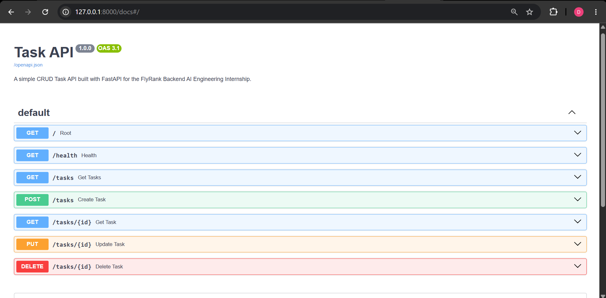
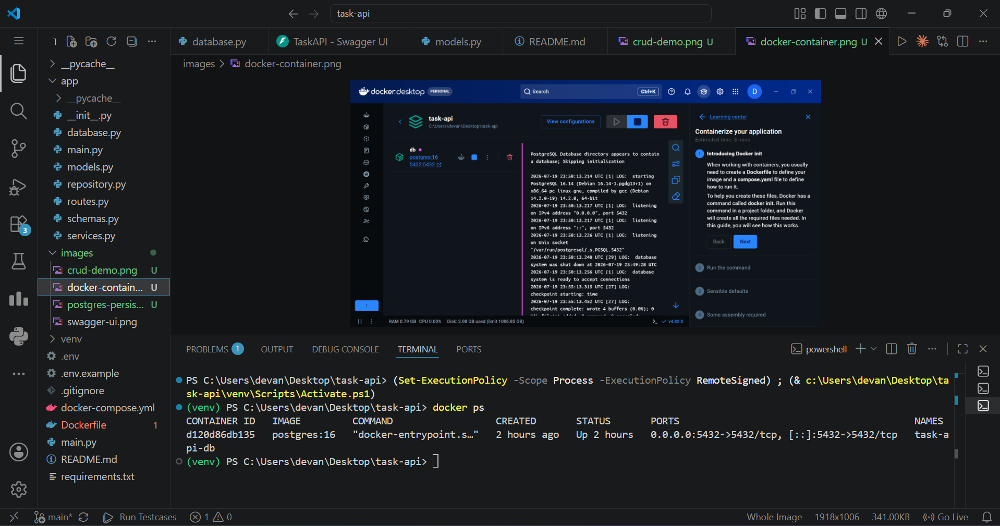
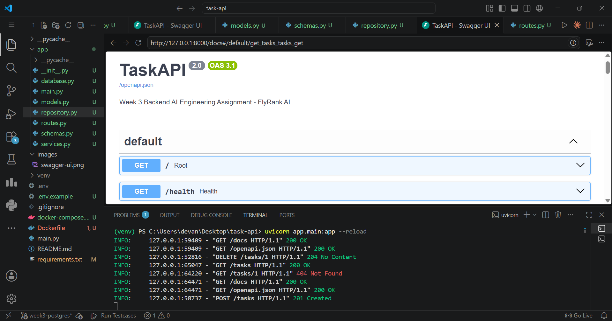
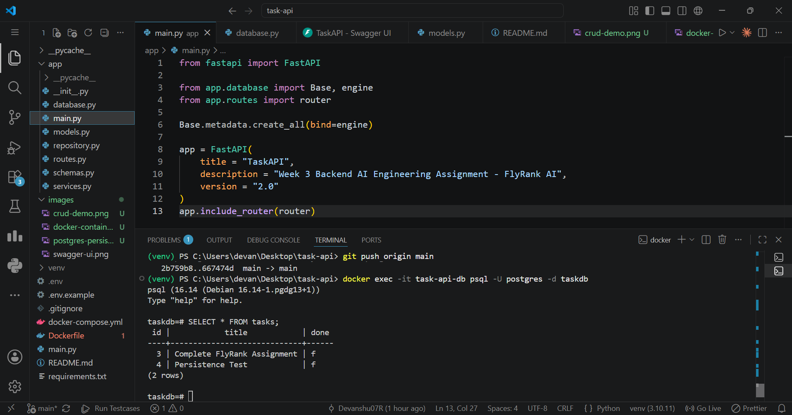

# Task API

## Backend AI Engineering Internship Journey • FlyRank AI

A production-ready **Task Management REST API** built progressively throughout the **FlyRank AI Backend AI Engineering Internship**.

Instead of creating separate repositories for every assignment, this repository evolves week by week, demonstrating how a backend application grows from a simple CRUD API into a production-ready backend system.

---

# 📖 About the Project

This repository documents my complete learning journey in FlyRank AI Backend AI Engineering internship.

Each assignment builds upon the previous one while keeping the same project alive, just like a real software product evolves over time.

Every new assignment introduces new backend concepts, technologies, architectural improvements, and engineering best practices.

---

# 📅 Internship Progress

| Week | Code | Assignment | Status |
|------|------|------------|:------:|
| Week 2 | **BE-01** | Build Your First CRUD API | ✅ Completed |
| Week 3 | **BE-04** | Containerize Your Stack | ✅ Completed |
| Week 3 | **BE-02** | Connecting to the Database | ✅ Completed |
| Week 4 | TBD | Coming Soon | 🔜 |
| Week 4 | TBD | Future Assignment | 🔜 |

---

# 🏗 Project Evolution

## Phase 1 — CRUD API

```
Client
    │
FastAPI
    │
In-Memory Storage
```

Completed in:

✅ Week 2 — BE-01

---

## Phase 2 — Docker + PostgreSQL

```
Client
     │
FastAPI
     │
Repository Layer
     │
SQLAlchemy ORM
     │
PostgreSQL
     │
Docker Volume
```

Completed in:

✅ Week 3 — BE-04

---

## Phase 3 — SQLite Database

```
Client
     │
FastAPI
     │
Repository Layer
     │
SQLAlchemy ORM
     │
SQLite Database
```

Completed in:

✅ Week 3 — BE-02


---

## Future Architecture

```
                Client
                   │
               FastAPI
                   │
          Repository Pattern
                   │
        ┌──────────┴──────────┐
        │                     │
    PostgreSQL           Redis Cache
        │                     │
     Docker             Background Jobs
```

---

# ✨ Features

## Completed

- ✅ RESTful CRUD API
- ✅ FastAPI
- ✅ Swagger Documentation
- ✅ Health Check Endpoint
- ✅ SQLAlchemy ORM
- ✅ Repository Pattern
- ✅ PostgreSQL
- ✅ Docker
- ✅ Docker Compose
- ✅ Persistent Docker Volumes
- ✅ Environment Variables
- ✅ SQLite database integration
- ✅ SQLAlchemy ORM	
- ✅ Automatic database creation
- ✅ Automatic table creation
- ✅ Automatic sample data insertion
- ✅ Persistent storage
- ✅ CRUD API

---

## Currently Working On

- 🚧 SQLite Database
- 🚧 SQL Queries
- 🚧 Automatic Database Creation
- 🚧 Persistent Local Database

---

## Upcoming

- 🔜 Authentication (JWT)
- 🔜 Redis
- 🔜 Alembic Migrations
- 🔜 Unit Testing
- 🔜 GitHub Actions
- 🔜 CI/CD
- 🔜 Kubernetes Deployment

---

# 🛠 Tech Stack

| Category | Technology |
|-----------|------------|
| Language | Python 3.10+ |
| Framework | FastAPI |
| Database | PostgreSQL / SQLite |
| ORM | SQLAlchemy |
| Validation | Pydantic |
| Containerization | Docker |
| Orchestration | Docker Compose |
| API Docs | Swagger UI |
| Server | Uvicorn |

---

# 📂 Project Structure

```text
task-api/
│
├── app/
│   ├── __init__.py
│   ├── database.py
│   ├── main.py
│   ├── models.py
│   ├── repository.py
│   ├── routes.py
│   ├── schemas.py
│   └── services.py
│
├── images/
│
├── Dockerfile
├── docker-compose.yml
├── requirements.txt
├── .env.example
├── README.md
└── .gitignore
```

---

# ✅ Assignment Tracker

---

## Week 2 — BE-01

### Build Your First CRUD API

### Concepts Learned

- FastAPI
- REST APIs
- CRUD Operations
- HTTP Methods
- Pydantic
- Swagger Documentation

### Completed

- GET
- POST
- PUT
- DELETE
- Health Check
- Validation
- Interactive API Docs

Status

✅ Completed

---

## Week 2 — BE-04

### Containerize Your Stack

### Concepts Learned

- Docker
- Docker Compose
- PostgreSQL
- SQLAlchemy
- Repository Pattern
- Environment Variables
- Docker Volumes

### Completed

- PostgreSQL Container
- SQLAlchemy Integration
- Persistent Storage
- CRUD with PostgreSQL
- Docker Compose
- Repository Pattern

Status

✅ Completed

---

## Week 3 — W3 · A1

### Connecting CRUD to SQLite

### Objectives

- Replace PostgreSQL with SQLite
- Keep API unchanged
- Store data in tasks.db
- Automatic database creation
- Automatic table creation
- Automatic sample task insertion
- SQL Queries
- Data persistence after restart

Status

✅ Completed

---

# 📡 API Endpoints

| Method | Endpoint | Description |
|---------|-----------|------------|
| GET | `/` | API Information |
| GET | `/health` | Health Check |
| GET | `/tasks` | Retrieve All Tasks |
| GET | `/tasks/{id}` | Retrieve One Task |
| POST | `/tasks` | Create Task |
| PUT | `/tasks/{id}` | Update Task |
| DELETE | `/tasks/{id}` | Delete Task |

---

# 📸 Screenshots 

## 📚 Swagger UI (W2 · A1 — Build your first CRUD API)



---

## 🐳 Docker Compose (A3 Containerize your stack)



---

## ✅ CRUD Operations (A3 Containerize your stack)



---

## 💾 PostgreSQL Persistence (A3 Containerize your stack)



---

## 🗄 SQLite Database (W3 · A1 — Connecting your CRUD to the database)


---

# 🚀 Getting Started

## Clone Repository

```bash
git clone https://github.com/Devanshu07R/flyrank-task-api.git

cd flyrank-task-api
```

---

## Create Virtual Environment

### Windows

```bash
python -m venv venv

venv\Scripts\activate
```

### Linux/macOS

```bash
python3 -m venv venv

source venv/bin/activate
```

---

## Install Dependencies

```bash
pip install -r requirements.txt
```

---

## Run the Application

```bash
uvicorn app.main:app --reload
```

---

## Swagger UI

```
http://127.0.0.1:8000/docs
```

---

# 📈 Learning Roadmap

```
✔ REST APIs

        ↓

✔ CRUD Operations

        ↓

✔ PostgreSQL

        ↓

✔ Docker

        ↓

🚧 SQLite

        ↓

⬜ Authentication

        ↓

⬜ Redis

        ↓

⬜ Testing

        ↓

⬜ CI/CD

        ↓

⬜ Kubernetes
```

---

# 👨‍💻 Author

## Devanshu Dasgupta

**Backend AI Engineering Intern — FlyRank AI**

- GitHub: https://github.com/Devanshu07R
- LinkedIn: https://www.linkedin.com/in/devanshudasgupta/

---

# ⭐ Support

If you found this repository useful, consider giving it a **Star ⭐**.

It motivates me to continue building and documenting my Backend AI Engineering journey.
